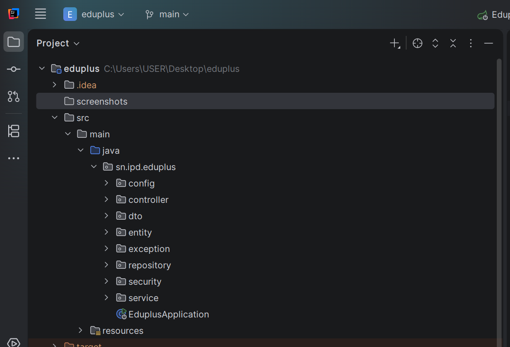
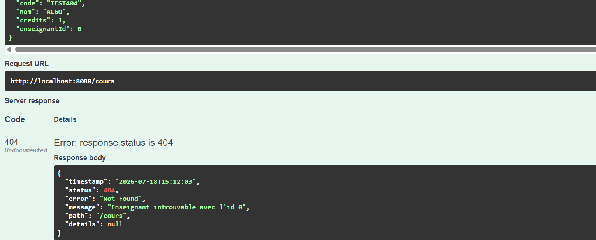
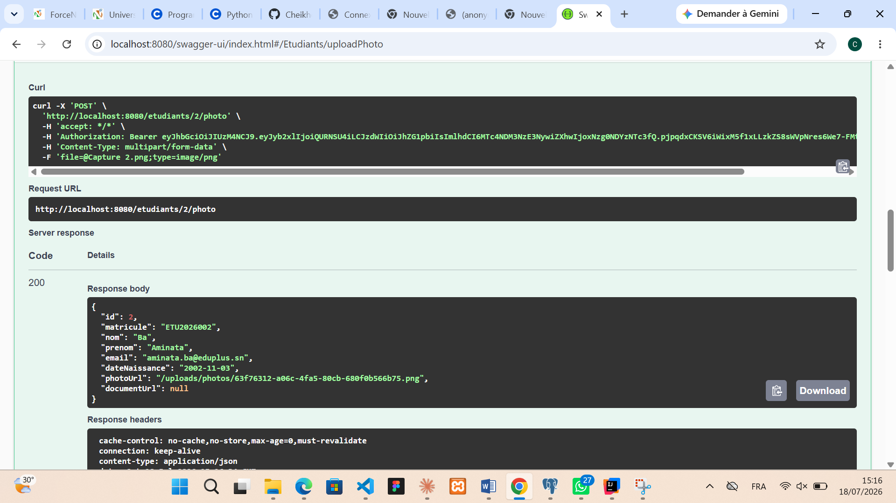

# Rapport technique — Projet EduPlus (API REST Spring Boot)
**Institut Polytechnique de Dakar (IPD)**
**Département Informatique**
**Module :** Projet de Développement Web Avancé (PDWA-L3)
**Niveau :** Licence 3 Informatique — Année académique 2025-2026
**Professeur :** [Monsieur LY]
**Groupe :** [ Cheikh COUNDOUL , Mouhamed TOURE , Ababacar Sadekh CISEE]

---

# Rapport technique — Projet EduPlus (API REST Spring Boot)

## 1. Présentation du projet
...

# Rapport technique — Projet EduPlus (API REST Spring Boot)

## 1. Présentation du projet

- Contexte : système de gestion scolaire pour l'établissement EduPlus (étudiants, enseignants, cours, inscriptions), avec contrôle d'accès par rôle (ADMIN, ENSEIGNANT, ETUDIANT).
- Membres du groupe : [tes noms + ceux de tes coéquipiers]
- Répartition des tâches : [qui a fait quoi — même si tu as porté la majeure partie du dev, sois honnête sur la répartition réelle]

## 2. Architecture technique

- Stack : Java 17, Spring Boot 3.3.2, Spring Security, Spring Data JPA (Hibernate), PostgreSQL, JWT (jjwt 0.12.5), Swagger/OpenAPI 3 (springdoc).
- Architecture en couches : `controller` → `service` → `repository` → `entity`, avec des `dto` dédiés en entrée/sortie pour ne jamais exposer directement les entités JPA (évite par exemple d'exposer le mot de passe haché d'un `User`).
- Modèle de données : 6 entités — `User`/`Role` (comptes et authentification), `Etudiant`, `Enseignant`, `Cours` (relation ManyToOne vers `Enseignant`), `Inscription` (table de liaison ManyToOne vers `Etudiant` et `Cours`, avec contrainte d'unicité pour éviter une double inscription).
  
## 3. Sécurité — JWT

- Authentification stateless : à la connexion (`/auth/login`), un token JWT signé en HMAC est généré et embarque le rôle de l'utilisateur dans ses claims.
- Un filtre (`JwtAuthFilter`, `OncePerRequestFilter`) intercepte chaque requête, extrait le token de l'en-tête `Authorization`, le valide et peuple le `SecurityContext` avant que la requête n'atteigne le controller.
- Le contrôle d'accès par rôle est déclaré dans `SecurityConfig` via `authorizeHttpRequests`, avec des règles différentes selon la méthode HTTP (ex : `GET /etudiants` accessible à ADMIN et ENSEIGNANT, mais création/modification/suppression réservées à ADMIN).
- JWT plutôt que des sessions classiques : ça permet une API stateless (le serveur ne stocke aucun état de session), ce qui simplifie le scaling horizontal et convient bien à une API REST consommée par un client externe (front, Postman, etc.).
- **Difficulté rencontrée** : lors des tests dans Swagger, un premier essai d'authentification renvoyait systématiquement une erreur 403 alors que le token semblait valide. En inspectant la requête `curl` générée par Swagger, on a découvert qu'un guillemet du JSON de réponse avait été collé par erreur en même temps que le token (copier-coller depuis le champ `"token": "eyJ..."` sans exclure les guillemets). Le filtre JWT rejetait silencieusement ce token malformé, ce qui donnait l'impression d'un problème de permissions alors que c'était un problème de copier-coller. Ça nous a appris à toujours vérifier la requête brute générée (`curl`) en cas d'erreur d'authentification inattendue plutôt que de supposer un bug côté serveur.
  [Sécurité JWT](screenshots/POST-auth-login.png)
## 4. Gestion des exceptions

- Un `@RestControllerAdvice` (`GlobalExceptionHandler`) centralise toutes les erreurs de l'API et renvoie un format JSON uniforme : `timestamp`, `status`, `error`, `message`, `path`, et `details` pour les erreurs de validation.
- Exceptions métier custom : `ResourceNotFoundException` (404), `DuplicateResourceException` (409, ex : matricule ou email déjà utilisé), `InvalidFileException` (400, fichier upload invalide).
- **Exemple concret** : lors d'un test de création de cours avec un `enseignantId` inexistant (id `0`, alors que les enseignants générés vont de 1 à 3), l'API a renvoyé une erreur 404 propre : `{"status":404,"error":"Not Found","message":"Enseignant introuvable avec l'id 0","path":"/cours"}`. Ça confirme que la couche service valide bien l'existence des relations avant la création, et que l'erreur remonte au client de façon exploitable plutôt qu'une trace de pile brute.
  
## 5. Upload de fichiers

- Photo de profil (JPEG/PNG, 2 Mo max) et documents PDF (5 Mo max), validés par type MIME réel (`file.getContentType()`) et par taille avant tout enregistrement sur disque.
- Chaque fichier est renommé avec un UUID à l'enregistrement pour éviter les collisions de noms et les caractères spéciaux problématiques.
- **Difficulté rencontrée** : lors du premier test d'upload dans Swagger, l'appel renvoyait "Required field is not provided" alors que le fichier était bien sélectionné. En fait, c'est le paramètre `id` du chemin (`/etudiants/{id}/photo`), affiché plus haut dans le formulaire Swagger, qui était resté vide — l'erreur ne venait donc pas du fichier lui-même. Ça montre l'importance de bien relire tous les paramètres requis d'un endpoint avant de conclure à un bug.
  
## 6. Difficultés rencontrées

- Configuration de l'environnement local : deux instances PostgreSQL installées en parallèle (versions 16 et 18) écoutant sur des ports différents (5433 au lieu du 5432 par défaut), ce qui a nécessité d'adapter les variables d'environnement de connexion.
- Ordre d'initialisation des données : `data.sql` s'exécutait par défaut avant que Hibernate ait créé le schéma (`ddl-auto: update`), ce qui provoquait une erreur "la relation n'existe pas". La propriété `spring.jpa.defer-datasource-initialization: true` a permis de forcer l'exécution des scripts SQL après la création du schéma.
- Format des variables d'environnement dans IntelliJ : les variables doivent être séparées par des points-virgules (`;`) et non des espaces, sinon seule la première variable est prise en compte.
- [Ajoute ici une vraie difficulté personnelle que TOI tu as rencontrée en comprenant le code ou en travaillant avec ton groupe]

## 7. Pistes d'amélioration

- Tests unitaires/intégration plus poussés (JUnit + Mockito, Testcontainers pour PostgreSQL).
- Refresh token pour prolonger une session sans redemander les identifiants.
- Migration vers Flyway au lieu de `ddl-auto: update`, plssssus adapté à un contexte de production.
- Rôle ENSEIGNANT plus fin (voir uniquement les étudiants inscrits à ses propres cours).

## 8. Conclusion

Ce projet nous a permis de mettre en pratique de manière concrète les concepts vus en cours sur Spring Boot,
en particulier la sécurisation d'une API avec Spring Security et JWT, sujet que nous maîtrisions surtout en théorie avant ce projet.
La gestion du temps a été un vrai défi : avec un planning sur 4 semaines couvrant plusieurs notions avancées (sécurité, upload, gestion d'exceptions), il a fallu apprendre à prioriser les fonctionnalités essentielles avant de peaufiner les détails secondaires.
Les différentes erreurs rencontrées pendant le développement et les tests (configuration de la base de données, ordre d'initialisation des scripts SQL, gestion des tokens JWT) nous ont aussi appris l'importance de bien lire les messages d'erreur et de tester chaque endpoint méthodiquement plutôt que de supposer que tout fonctionne du premier coup.